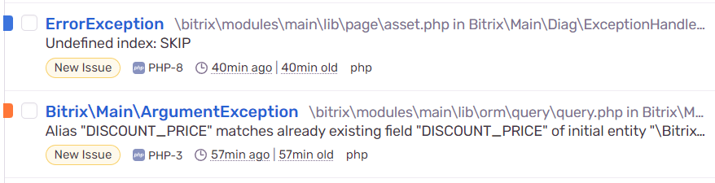

# Модуль логирования в Sentry

Модуль предназначен для логирования и перехвата ошибок из CMS Bitrix в сервис [Sentry](http://marketplace.1c-bitrix.ru/solutions/intensa.logger/)



## Установка модуля

Модуль можно установить через маркетплейс [http://marketplace.1c-bitrix.ru/solutions/bugrovweb.sentrylog/](http://marketplace.1c-bitrix.ru/solutions/bugrovweb.sentrylog/)

В момент установки происходит обновление файла `bitrix/.settings` - в секции `exception_handling` прописываются следующие настройки:

- ```php
  'exception_handling' => 
  array (
    'value' => 
    array (
      'debug' => true, // включается дебаг
        ...
  ```
- ```php
  'exception_handling' => 
  array (
    'value' => 
    array (
    ...
      'log' => 
        array (
         ...
        'class_name' => '\\Bugrovweb\\Sentrylog\\SentryException', // подключается класс для работы с исключениями
        'required_file' => 'modules/bugrovweb.sentrylog/lib/general/SentryException.php', // путь к классу для работы с исключениями
        ...
  ```
  
Эти настройки нужны для корректной настройки модуля. При деинсталляции модуля настройки `class_name` и `required_file` будут удалены.

## Настройки модуля

После успешной настройки модуля переходим к его настройкам [bitrix/admin/settings.php?mid=bugrovweb.sentrylog&lang=ru](bitrix/admin/settings.php?mid=bugrovweb.sentrylog&lang=ru)

- **DSN (Data Source Name)** - указываем DSN, выданный после регистрации в личном кабинете Sentry. Если не указать, модуль будет брать настройку `SENTRY_DSN` из .env. В противном случае модуль работать не будет.
- **Среда разработки (Environment)** - указываем среду разработки (любое понятное значение, например production). Используется для пометки, где произошла ошибка: продакшн, дев-сервер и т.д. Если среда разработки не указана, модуль будет брать настройку SENTRY_MODE из .env. В противном случае модуль будет устанавливать значение `local`
- Если среда разработки указана как `local`, логирование в Sentry производиться не будет.
- **Игнорировать исключения** - можно указать тип ошибок класса `ExceptionHandlerLog`, которые будут проигнорированы модулем.

**Важное примечание**. Настройки модуля имеют приоритет перед переменными файла .env!

## Работа модуля

- Модуль берет текущую конфигурацию `bitrix/.setting.php` и проверяет типы ошибок, которые система отлавливает (`handled_errors_types`). Таким образом модуль передает данную настройку в [Sentry](https://docs.sentry.io/platforms/php/configuration/options/#error-types)
- Если будет вызвана ошибка, не подходящая по типу под текущий `handled_errors_types`, то событие не будет отправлено в Sentry
- Если будет вызвана ошибка, тип которой исключен в настройках модуля (*Игнорировать исключения*), то событие также не будет отправлено в Sentry
- Остальные ошибки (подходящие под текущий `handled_errors_types` и не ограниченные в настройках модуля) отправляются в Sentry.

## Возможные ошибки и решение

### События не отправляются в Sentry

- Проверьте настройку `debug` в секции `handled_errors_types` файла `bitrix/.setting.php`. Она должна быть установлена в `true`
- Проверьте настройку `log` в секции `handled_errors_types` файла `bitrix/.setting.php`. В ней дожно содержаться два следующих ключа: `class_name` и `required_file`. Если их нет, либо они пусты, заполните их самостоятельно:
  ```php
  'exception_handling' => 
  array (
    'value' => 
    array (
    ...
      'log' => 
        array (
         ...
        'class_name' => '\\Bugrovweb\\Sentrylog\\SentryException',
        'required_file' => 'modules/bugrovweb.sentrylog/lib/general/SentryException.php',
        ...
  ```
- Проверьте настройку модуля *DSN*. Она не должна быть пуста. Если Вы используете .env, проверьте настройку SENTRY_DSN
- Проверьте настройку модуля *Среда разработки (Environment)*. Если Вы используете .env, проверьте настройку SENTRY_MODE. Если они обе пусты - значит модуль по умолчанию установил `local`, соответственно логирование производиться не будет